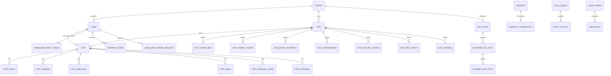

# Database Schema and ERD

## Purpose
This document is the maintained schema reference for frontend, backend, QA, and data/reporting teams.

Source of truth:
- `src/TowerOps.Infrastructure/Persistence/ApplicationDbContext.cs`
- `src/TowerOps.Infrastructure/Persistence/Configurations/*`
- `src/TowerOps.Infrastructure/Persistence/Migrations/*`

## Scope
- Includes persisted entities currently registered in EF Core DbContext.
- Includes high-level logical relationships for operational workflows.
- Marks inferred relationships explicitly where linkage is by business key (for example `SiteCode`) instead of direct FK property.

## Physical Entity Inventory

### Visits
- `Visit`
- `VisitPhoto`
- `VisitReading`
- `VisitChecklist`
- `VisitMaterialUsage`
- `VisitIssue`
- `VisitApproval`

### Sites
- `Site`
- `SiteTowerInfo`
- `SitePowerSystem`
- `SiteRadioEquipment`
- `SiteTransmission`
- `SiteCoolingSystem`
- `SiteFireSafety`
- `SiteSharing`

### Work Execution and Governance
- `WorkOrder`
- `Escalation`
- `ApprovalRecord`
- `AuditLog`

### Users and Access
- `User`
- `ApplicationRole`
- `Office`
- `PasswordResetToken`
- `RefreshToken`

### Planning
- `DailyPlan`
- `EngineerDayPlan` (owned/persisted via DailyPlan aggregate mapping)
- `PlannedVisitStop` (owned/persisted via DailyPlan aggregate mapping)

### Inventory and Assets
- `Material`
- `MaterialTransaction`
- `Asset`
- `UnusedAsset`
- `BatteryDischargeTest`

### Client / Portal / Configuration
- `Client`
- `SystemSetting`
- `SyncQueue`
- `SyncConflict`
- `ChecklistTemplate`
- `UserDataExportRequest`

## High-Level ERD (Logical)

## Relationship Notes (Important)
- `WorkOrder` currently links to site using business key fields (`SiteCode`, `OfficeCode`) instead of direct `SiteId` FK property.
- Portal scoping uses `Site.ClientCode` and user portal claims (`User.ClientCode`, `User.IsClientPortalUser`).
- Visit evidence exposure to reports/portal is filtered by `VisitPhoto.FileStatus == Approved`.
- Soft delete global filter applies to entities inheriting `Entity<Guid>` (`IsDeleted == false` by default query filter).

## Data Governance Fields
Key governance fields that impact retention/privacy behavior:
- `IsDeleted`, `DeletedAt` (soft delete lifecycle)
- `IsUnderLegalHold` (purge block)
- timestamps (`CreatedAt`, `UpdatedAt`, domain-specific occurred/measured fields)

## Change Management Rule
When a migration adds/removes entity shape:
1. Update this document in the same PR.
2. Link migration file names in PR description.
3. Run `tools/check_doc_drift.py`.

